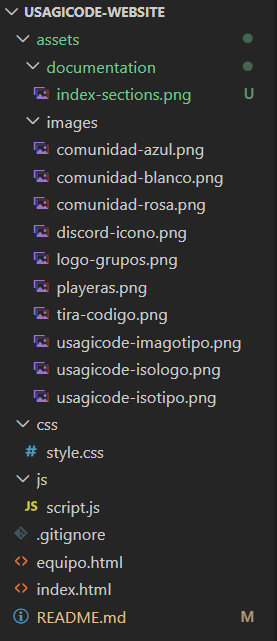
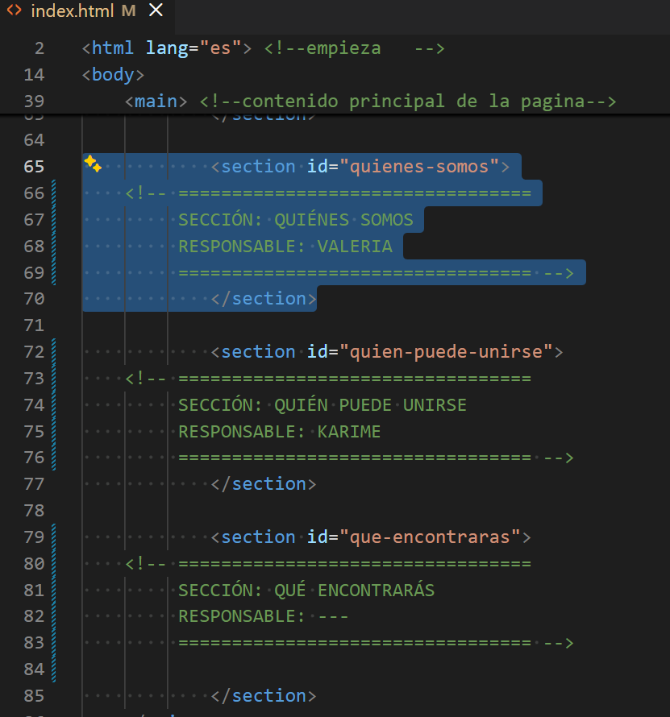
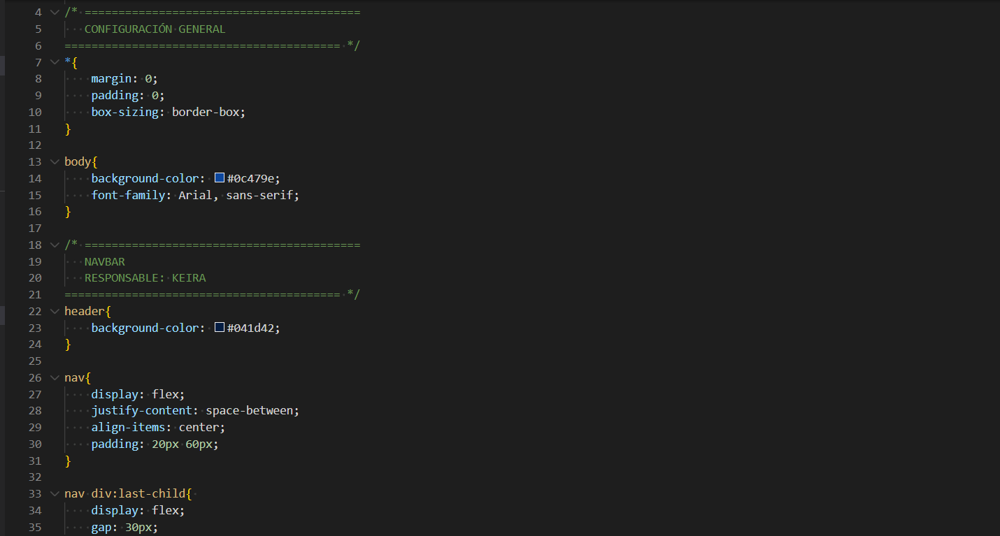

# usagicoders-website

## **Reglas**
1. No modificar directamente la rama `main`.
2. Crear una rama para cada funcionalidad/persona tomando como base la rama develop.
3. Hacer commits con mensajes descriptivos sobre los cambios que realicen.
4. Subir los cambios a GitHub.
5. No borrar archivos de otros integrantes sin avisar.

> Aquí les dejo el tutorial para crear sus ramas a partir de `develop`. \
> (**Ojo**: primero deben clonar el repositorio)

> Recuerden que pueden experimentar siempre y cuando sea en sus ramas para evitar afectar a las demas en caso de romper algo. No olviden hacer `git pull` como buen habito. Pueden hacer la cantidad de commits que sean necesarias, no tienen que tener terminada toda su sección ya que el proposito de tenerlo en github es llevar un control de versiones.

## **Estructura del proyecto**
usagsicode-website\
│\
├── index.html          ← Página principal\
├── equipo.html         ← Página del equipo\
│\
├── css/\
│   └── style.css       ← Estilos visuales\
│\
├── js/\
│   └── script.js       ← JavaScript\
│\
├── assets/\
│   ├── images/         ← Imágenes\
│   └── documentation/  ← Imágenes de la documentacion\
│\
└── README.md           ← Documentación del proyecto\

### **index.html**
Es la página principal. Aquí se encuentran las secciones de Inicio, quienes somos (nosotros), quién puede unirse y qué encontrarás.

Dejé asignada cada "section", asi que podran hacer las modificaciones que sean necesarias unicamente en los section que le corresponda a cada una.

### **equipo.html**
Página en donde se muestran los integrantes del equipo fundador.
Se puede agregar:
- Información de los integrantes 
- Fotos
- Redes sociales (discord, github, otra q quieran)

### **css/style.css**
Contiene losa estilos visuales de la página, támbien deje asignado el área en donde cada una puede editar. 

En configuración general se encuentra el color de fondo de la página y las tipografias, asi que cualquier cambio realizado en esa seccion afecta al estilo de TODA la página, tanto index.html como equipo.html. \
> ⚠️ Consultar con el grupo en caso de tener la necesidad o querer modificar esa sección.

### **assets/**
Contiene todas las imágenes que se necesitan en la pagina (iconos, adornos, imagenes de fondos, etc.)

### **js/script.js**
Aquí iran las funciones interactivas (si es que decidimos si agregar).
Por ejemplo:
- Animaciones.
- Botones interactivos.

Por el momento no hay nada.